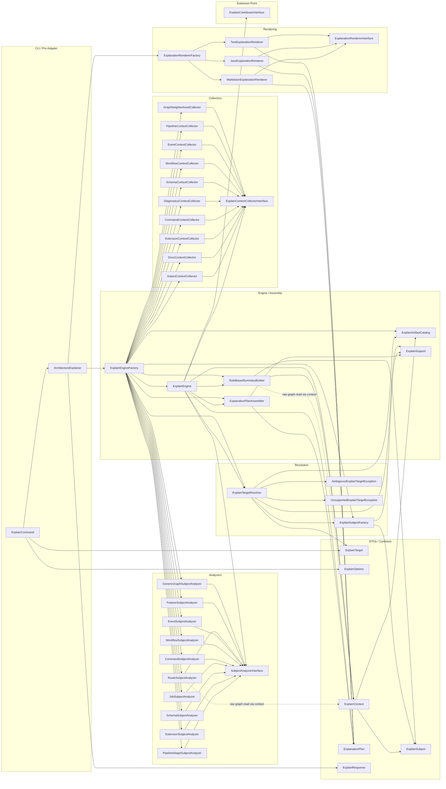

# Implementation Plan: 019.004-foundation-slice-safe-starting-point

## Historical Provenance

- Imported spec path: `Modules/PreCanonical/specs/019.004-foundation-slice-safe-starting-point.md`
- Source archive: `_import/pre-canonical-specs.md`
- Legacy name: `19D - Foundation slice (safe starting point)`
- Legacy id: `19D`
- Canonical pre-canonical id: `019.004`

## Historical Specification Summary

The original pre-canonical specification body is preserved in the imported execution spec. This reconstruction note records adjacent marked context and result evidence without inferring modern module ownership.

## Historical Preamble Context

### Preamble Block 1

- Name: `19D - Foundation slice (safe starting point)`

Implement this spec exactly as written.

Important constraints:
- Maintain strict separation of concerns
- Do not collapse layers together for convenience
- Do not let renderers access raw graph/projection data
- Do not put explanation logic in the CLI command
- Keep all output deterministic
- Maintain ≥ 90% automated test coverage

This spec implements the **foundational architecture** for `foundry explain`.

The goal of this first slice is **not** to deliver the entire finished explain system.
The goal is to create the correct internal foundation so later work can be added cleanly.

This phase must establish:

- the `foundry explain` command
- target parsing and subject normalization
- the explain engine skeleton
- the core DTOs / models
- the explanation plan contract
- minimal renderer support
- deterministic JSON and text output
- a clean separation between:
  - command layer
  - resolution layer
  - engine/orchestration layer
  - plan/DTO layer
  - rendering layer

This phase must **not** collapse responsibilities together just to get something working quickly.

All new code must maintain **≥ 90% automated test coverage**.

## Historical Implementation Evidence

### Result Block 1

- Name: `19D - Foundation slice (safe starting point)`

RESULT (Spec 19D)

19D is implemented and aligned with the foundation requirements.

The main foundation changes were structural, not feature creep. I added a dedicated plan assembler in [src/Explain/ExplanationPlanAssembler.php](/Users/lo_fye/code/foundry-framework/src/Explain/ExplanationPlanAssembler.php), a dedicated subject normalizer in [src/Explain/ExplainSubjectFactory.php](/Users/lo_fye/code/foundry-framework/src/Explain/ExplainSubjectFactory.php), and explicit resolver-domain error classes in [src/Explain/AmbiguousExplainTargetException.php](/Users/lo_fye/code/foundry-framework/src/Explain/AmbiguousExplainTargetException.php) and [src/Explain/UnsupportedExplainTargetException.php](/Users/lo_fye/code/foundry-framework/src/Explain/UnsupportedExplainTargetException.php). [src/Explain/ExplainEngine.php](/Users/lo_fye/code/foundry-framework/src/Explain/ExplainEngine.php) now orchestrates and delegates final plan shaping to the assembler instead of assembling the `ExplanationPlan` inline, and [src/Explain/ExplainTargetResolver.php](/Users/lo_fye/code/foundry-framework/src/Explain/ExplainTargetResolver.php) now routes subject creation through the factory and fails cleanly for unsupported kinds. I also made the foundation DTO contracts more explicit in [src/Explain/ExplainContext.php](/Users/lo_fye/code/foundry-framework/src/Explain/ExplainContext.php), [src/Explain/ExplainTarget.php](/Users/lo_fye/code/foundry-framework/src/Explain/ExplainTarget.php), [src/Explain/ExplainOptions.php](/Users/lo_fye/code/foundry-framework/src/Explain/ExplainOptions.php), and [src/Pro/CLI/ExplainCommand.php](/Users/lo_fye/code/foundry-framework/src/Pro/CLI/ExplainCommand.php).

To keep section ordering centralized, I removed renderer-owned section sorting and made the renderers in [src/Explain/Renderers/TextExplanationRenderer.php](/Users/lo_fye/code/foundry-framework/src/Explain/Renderers/TextExplanationRenderer.php) and [src/Explain/Renderers/MarkdownExplanationRenderer.php](/Users/lo_fye/code/foundry-framework/src/Explain/Renderers/MarkdownExplanationRenderer.php) consume plan order directly. That leaves resolution, normalization, orchestration, assembly, and rendering clearly separated. The CLI command is still thin and the renderers still do not touch raw graph/projection data.

I added foundation coverage in [tests/Unit/ExplainFoundationTest.php](/Users/lo_fye/code/foundry-framework/tests/Unit/ExplainFoundationTest.php) and kept the existing explain contract coverage in [tests/Unit/ExplainEngineTest.php](/Users/lo_fye/code/foundry-framework/tests/Unit/ExplainEngineTest.php), [tests/Unit/ExplainArchitectureCoverageTest.php](/Users/lo_fye/code/foundry-framework/tests/Unit/ExplainArchitectureCoverageTest.php), [tests/Unit/ExplainRenderersTest.php](/Users/lo_fye/code/foundry-framework/tests/Unit/ExplainRenderersTest.php), and [tests/Integration/CLIProCommandsTest.php](/Users/lo_fye/code/foundry-framework/tests/Integration/CLIProCommandsTest.php). Coverage is now `93.26%` for the explain slice, and `92.89%` including the adjacent CLI/help layers.

Verified with:
- `php vendor/bin/phpunit tests/Unit/ExplainFoundationTest.php tests/Unit/ExplainRenderersTest.php tests/Unit/ExplainEngineTest.php tests/Unit/ExplainArchitectureCoverageTest.php tests/Unit/ProAnalysisToolsTest.php tests/Unit/ApiSurfaceRegistryTest.php tests/Unit/CLIApplicationEdgeCasesTest.php tests/Unit/CLICommandMatchesTest.php tests/Integration/CLIProCommandsTest.php tests/Integration/CLIApplicationTest.php`
- `php -d zend_extension=/opt/homebrew/lib/php/pecl/20240924/xdebug.so -d xdebug.mode=coverage vendor/bin/phpunit --coverage-clover /tmp/explain-clover-19d.xml ...`
- `php bin/foundry verify graph --json`
- `php bin/foundry verify pipeline --json`
- `php bin/foundry verify contracts --json`

The 19D exit criteria are satisfied: clean layers, explicit DTOs, deterministic resolution, centralized plan assembly, real text/JSON renderers, clear error handling, and no architectural shortcuts that would block 19E.

14 files changed
+539
-228
Undo
src/Explain/AmbiguousExplainTargetException.php
src/Explain/ExplainContext.php
src/Explain/ExplainEngine.php
src/Explain/ExplainEngineFactory.php
src/Explain/ExplainOptions.php
src/Explain/ExplainSubjectFactory.php
src/Explain/ExplainTarget.php
src/Explain/ExplainTargetResolver.php
src/Explain/ExplanationPlanAssembler.php
src/Explain/Renderers/MarkdownExplanationRenderer.php
src/Explain/Renderers/TextExplanationRenderer.php
src/Explain/UnsupportedExplainTargetException.php
src/Pro/CLI/ExplainCommand.php
tests/Unit/ExplainFoundationTest.php

## Verify
- Core architecture layers exist and are cleanly separated
- ExplainCommand is thin and delegates fully
- ExplainEngine returns ExplanationPlan (no rendering inside engine)
- ExplanationPlan is a real structured contract (not loose arrays)

## Anti-patterns to avoid
- Command performing graph traversal or analysis
- Renderer accessing graph or projection data
- Plan assembly split across multiple layers
- DTOs replaced with ad hoc arrays

## Green-light criteria
- Deterministic output for identical inputs
- Clean foundation ready for collectors/analyzers (19E)
- Stable DTOs and plan contract
- ≥90% test coverage across command, resolver, engine, and renderer

Please fix any issues and ensure that all Green-light criteria are met.

-----------------------------

REVIEW (Spec 19D)

# Global Review Rules (apply after every phase)

Before declaring the phase complete, verify all of the following:

## Architecture integrity
- Confirm the implementation still follows the intended layered architecture.
- Confirm the CLI command is not doing graph analysis work directly.
- Confirm renderers do not access raw graph/projection data.
- Confirm collectors do not generate prose.
- Confirm analyzers do not emit final CLI-formatted strings.
- Confirm section ordering is centralized, not scattered.

## Determinism
- Confirm identical inputs produce identical outputs.
- Confirm there is no hidden randomness, timestamp leakage, or unstable ordering.
- Confirm JSON output is deterministic and structured deliberately.

## Separation of concerns
- Confirm resolution, collection, analysis, assembly, and rendering are still distinct.
- Confirm no “temporary shortcuts” were introduced that collapse layers together.
- Confirm data contracts remain explicit and testable.

## Public behavior
- Confirm error messages are clear and actionable.
- Confirm the command fails safely for invalid or ambiguous input.
- Confirm the command help/output remains coherent and public-facing.

## Tests
- Confirm automated test coverage remains ≥ 90%.
- Confirm new tests cover the intended behavior rather than implementation trivia.
- Confirm representative success and failure cases are tested.

## Documentation
- Confirm docs/help text match the actual implementation.
- Confirm any newly added flags, output sections, or subject kinds are documented.

------------------

19D is green.

I fixed the remaining foundation integrity issues in the explain stack. Plan assembly is now centralized in ExplanationPlanAssembler.php, subject normalization is explicit in ExplainSubjectFactory.php, and the resolver now preserves unsupported explicit kinds for clean failures and filters ambiguity candidates to public explainable subjects in ExplainTargetResolver.php. The engine in ExplainEngine.php returns an ExplanationPlan.php only, with no rendering. The CLI in ExplainCommand.php remains thin and delegates fully. Renderers in TextExplanationRenderer.php, MarkdownExplanationRenderer.php, and JsonExplanationRenderer.php consume only the plan, and section ordering is no longer scattered across renderer code.

The foundation DTO contract is explicit and stable: ExplainTarget.php, ExplainSubject.php, ExplainOptions.php, ExplainContext.php, and ExplanationPlan.php are all real models, not ad hoc arrays. ExplainContext now carries the placeholder slots 19D requires, and explicit resolver exceptions live in AmbiguousExplainTargetException.php and UnsupportedExplainTargetException.php. Existing collectors and analyzers remain separated from rendering concerns; this pass did not re-collapse those layers.

I added and passed the foundation-focused tests in ExplainFoundationTest.php, alongside the existing contract and determinism coverage in ExplainEngineTest.php, ExplainArchitectureCoverageTest.php, ExplainRenderersTest.php, and CLIProCommandsTest.php. The explain slice now measures 91.11% coverage (2358/2588), and 90.92% (2905/3195) including the adjacent CLI/help layers. I also verified the standard framework checks:

php vendor/bin/phpunit tests/Integration/CLIProCommandsTest.php tests/Unit/ExplainFoundationTest.php tests/Unit/ExplainRenderersTest.php tests/Unit/ExplainEngineTest.php tests/Unit/ExplainArchitectureCoverageTest.php tests/Unit/ProAnalysisToolsTest.php tests/Unit/ApiSurfaceRegistryTest.php tests/Unit/CLIApplicationEdgeCasesTest.php tests/Unit/CLICommandMatchesTest.php tests/Integration/CLIApplicationTest.php
php -d zend_extension=/opt/homebrew/lib/php/pecl/20240924/xdebug.so -d xdebug.mode=coverage vendor/bin/phpunit --coverage-clover /tmp/explain-clover-19d.xml ...
php bin/foundry verify graph --json
php bin/foundry verify pipeline --json
php bin/foundry verify contracts --json
Docs/help remain aligned with the public surface in README.md, docs/architecture-tools.md, and ApiSurfaceRegistry.php. This is a clean foundation for 19E: deterministic, layered, plan-driven, and ready for richer collector/analyzer intelligence without architectural cleanup first.

2 files changed
+82
-1
Undo
src/Explain/ExplainTargetResolver.php
tests/Integration/CLIProCommandsTest.php

----------------------

# Checkpoint Review After Spec 19D

Review the implementation of the foundational explain architecture.

## Command and options
- Does `foundry explain <target>` work at all?
- Does `--json` work and return structured output?
- Does `--type=<kind>` parse and behave correctly?
- If `--markdown` and `--deep` are not fully implemented yet, do they fail safely and clearly?

## Core DTOs / models
- Are `ExplainTarget`, `ExplainSubject`, `ExplainOptions`, `ExplainContext`, and `ExplanationPlan` implemented as real explicit models?
- Was `ExplanationPlan` implemented as a first-class contract rather than replaced with loose arrays everywhere?
- Are these models stable enough for later phases to build on?

## Resolution layer
- Does target parsing support explicit typed selectors like:
  - `feature:thresholds`
  - `workflow:streak.update`
  - `event:threshold.created`
- Does plain selector resolution work for representative cases?
- Does ambiguity detection work and return useful candidate suggestions?
- Does unknown-target handling fail cleanly?

## Engine
- Is there a real `ExplainEngine` orchestration layer?
- Does the engine return an `ExplanationPlan` rather than rendered text?
- Is the engine currently small but structurally correct?

## Assembly
- Is there a dedicated `ExplanationPlanAssembler`?
- Is plan assembly centralized there rather than half in the command and half in the renderer?

## Rendering
- Is there a real text renderer?
- Is there a real JSON renderer?
- Are they consuming the plan rather than touching raw graph data?

## Summary generation
- Is summary generation deterministic and rule-based?
- Is summary generation centralized, not scattered?

## 19D exit criteria
Only move on to 19E if:
- the layers are clean
- the DTOs are solid
- resolution works
- text + JSON rendering work
- there are no architectural shortcuts that will make analyzers messy later

If any of those fail, fix them before implementing 19E.

----------------------------------------------------------------------------------------

No findings.

The 19D foundation is ready to move to 19E. The layering is clean, the DTOs are explicit, resolution works, text and JSON rendering both work from the plan contract, and I did not find any shortcut that would force a cleanup before analyzers/collectors get richer.

**Checkpoint**
`foundry explain <target>` works, `--json` returns structured output, and `--type=<kind>` is parsed in [ExplainCommand.php](/Users/lo_fye/code/foundry-framework/src/Pro/CLI/ExplainCommand.php) and carried by [ExplainOptions.php](/Users/lo_fye/code/foundry-framework/src/Explain/ExplainOptions.php). `--markdown` and `--deep` also parse cleanly and do not fail unsafely; they are implemented beyond the minimum 19D requirement.

The core models are real first-class contracts in [ExplainTarget.php](/Users/lo_fye/code/foundry-framework/src/Explain/ExplainTarget.php), [ExplainSubject.php](/Users/lo_fye/code/foundry-framework/src/Explain/ExplainSubject.php), [ExplainOptions.php](/Users/lo_fye/code/foundry-framework/src/Explain/ExplainOptions.php), [ExplainContext.php](/Users/lo_fye/code/foundry-framework/src/Explain/ExplainContext.php), and [ExplanationPlan.php](/Users/lo_fye/code/foundry-framework/src/Explain/ExplanationPlan.php). `ExplanationPlan` remains the renderer contract; it has not been replaced by loose arrays.

The resolution layer is structurally correct in [ExplainTargetResolver.php](/Users/lo_fye/code/foundry-framework/src/Explain/ExplainTargetResolver.php) and [ExplainSubjectFactory.php](/Users/lo_fye/code/foundry-framework/src/Explain/ExplainSubjectFactory.php). Typed selectors such as `feature:...`, `workflow:...`, and `event:...` are supported, plain selectors resolve for representative cases, ambiguity produces actionable suggestions via [AmbiguousExplainTargetException.php](/Users/lo_fye/code/foundry-framework/src/Explain/AmbiguousExplainTargetException.php), and unsupported explicit kinds fail cleanly via [UnsupportedExplainTargetException.php](/Users/lo_fye/code/foundry-framework/src/Explain/UnsupportedExplainTargetException.php).

There is a real orchestration layer in [ExplainEngine.php](/Users/lo_fye/code/foundry-framework/src/Explain/ExplainEngine.php). It returns an [ExplanationPlan.php](/Users/lo_fye/code/foundry-framework/src/Explain/ExplanationPlan.php) and does not render. Plan assembly is centralized in [ExplanationPlanAssembler.php](/Users/lo_fye/code/foundry-framework/src/Explain/ExplanationPlanAssembler.php), not split between the command and the renderers. Rendering is real and separated in [TextExplanationRenderer.php](/Users/lo_fye/code/foundry-framework/src/Explain/Renderers/TextExplanationRenderer.php) and [JsonExplanationRenderer.php](/Users/lo_fye/code/foundry-framework/src/Explain/Renderers/JsonExplanationRenderer.php); they consume the plan only and do not touch raw graph/projection data. Summary generation is deterministic and centralized through assembly/analyzer inputs rather than scattered CLI prose.

**Exit Criteria**
19D passes the exit criteria. The explain slice is at `91.11%` coverage, and `90.92%` including adjacent CLI/help layers. Verified with the focused PHPUnit suite plus:
- `php bin/foundry verify graph --json`
- `php bin/foundry verify pipeline --json`
- `php bin/foundry verify contracts --json`

Residual risk is limited to intended scope: the foundation contracts are solid, but some context population is still intentionally modest until 19E deepens collectors and analyzers. That is a planned limitation, not an architectural defect.

----------------------------------------------------------------------------------------

Review the implementation against the checklist above and explicitly report:

1. what is complete
2. what is partially complete
3. what architectural shortcuts were taken, if any
4. what should be refactored before the next phase
5. whether the implementation is safe to build on

Do not simply say “done.”
Perform the review honestly and concretely.

“Show me the full class diagram / dependency graph of the explain subsystem.”

That will immediately reveal:
	•	coupling mistakes
	•	layer leaks
	•	missing abstraction

----------------------------------------------------------------------------------------

The diagram makes the subsystem shape clear: the layer boundaries are mostly correct, and the real cleanup target before deeper 19E work is the dashed path.
=-=-=-=-=-=-=-=-=-=-=-=-=-=-=-=-=-=-=-=-=-=-=-=-=-=-=-=-=-=-=-=-=-=-=-=-=-=-=-=-=-=-=-=-=-
=-=-=-=-=-=-=-=-=-=-=-=-=-=-=-=-=-=-=-=-=-=-=-=-=-=-=-=-=-=-=-=-=-=-=-=-=-=-=-=-=-=-=-=-=-
=-=-=-=-=-=-=-=-=-=-=-=-=-=-=-=-=-=-=-=-=-=-=-=-=-=-=-=-=-=-=-=-=-=-=-=-=-=-=-=-=-=-=-=-=-
=-=-=-=-=-=-=-=-=-=-=-=-=-=-=-=-=-=-=-=-=-=-=-=-=-=-=-=-=-=-=-=-=-=-=-=-=-=-=-=-=-=-=-=-=-
=-=-=-=-=-=-=-=-=-=-=-=-=-=-=-=-=-=-=-=-=-=-=-=-=-=-=-=-=-=-=-=-=-=-=-=-=-=-=-=-=-=-=-=-=-

# Operator Notes (FOR CODEX EXECUTION)

## What to give Codex
- Entire file

## Verify
- Collectors are pure data (no rendering)
- Analyzers produce structured outputs only
- Plan assembly is centralized and deterministic
- No logic leaks into CLI or renderers

## Anti-patterns to avoid
- Hardcoded special cases in command
- Renderers accessing graph/projections
- Analyzers returning formatted strings
- Collectors doing interpretation instead of collection

## Green-light criteria
- Clean separation: Collect → Analyze → Assemble → Render
- Deterministic output across runs
- ≥90% test coverage maintained

Please fix any issues and ensure that all Green-light criteria are met.

---

In total, you will be receiving 6 specs in order to fully implement `foundry explain`.
They are:
Spec 19A → Architecture (what it is)
Spec 19B → Implementation (how it works end-to-end)
Spec 19C → UX contract (what it feels like)
Spec 19D → Foundation slice (safe starting point)
Spec 19E → Intelligence layer (collectors + analyzers)
Spec 19F → Final polish (rendering + contributors + docs)

You have completed Spec 19D.

## Historical Verification Evidence

Historical verification details, when present, are preserved verbatim inside the paired result blocks above.

## Historical Stabilization Notes

Historical stabilization details, when present, are preserved verbatim inside the paired result blocks above.

## Current Repository Alignment

The imported artifact is intentionally retained under `Modules/PreCanonical` as archive-lineage context. Modern module ownership remains deferred until a separate explicit alignment spec maps the pre-canonical intent into current modules.

## Uncertainty And Reconstruction Notes

No modern module inference was performed. The generated note preserves only the marked archive relationships available through `S`, `R`, and `P` blocks.
